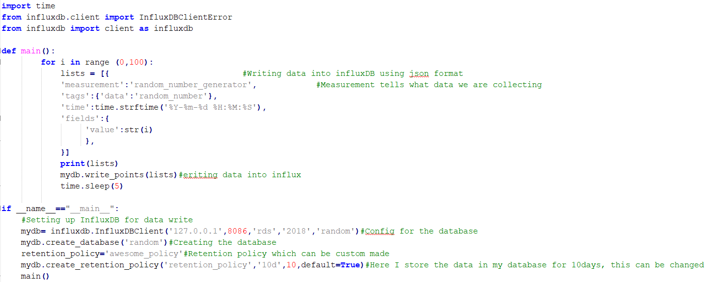

# Overview

Influx db is a time series database which is widely used to store IoT
data. It allows us to store sensor data along with timestamps of their
measurement, which makes it ideal for the huge amount of IoT data. In
addition to this the simple influx QL helps us to query the data
periodically using simple commands. Influx db along with grafana makes
it a very useful database to use.

**Note that we use pip  a package manager for python Replace pip with pip3 if you are using python3** 

**Installing InfluxDB using pip (preferred)**

pip install influxdb
pip install --upgrade influxdb

**Uninstalling InfluxDB:**

pip uninstall influxdb

**Alternate installation on Ubuntu (Along with grafana installation)**

Follow the link
[**http://www.andremiller.net/content/grafana-and-influxdb-quickstart-on-ubuntu**](http://www.andremiller.net/content/grafana-and-influxdb-quickstart-on-ubuntu)

**Some Useful commands for InfluxDB**

-   **show databases**: Shows all the databases you have created in
    Influx.

-   **use &lt;dbname&gt;** : To select the database you want to use e.g.
    : use sensordata.

-   **show measurements**: To show the measurement under which you are
    storing data.

-   **select \* from &lt;measurements&gt;**: To show all the things you
    have in database.

    e.g. select \* from sensor\_data

<!-- -->

-   **drop database sensordata**: To drop the database. This will delete
    the database from influx.

## Reference liks

+ [https://docs.influxdata.com/influxdb/v1.6/tools/shell/](https://docs.influxdata.com/influxdb/v1.6/tools/shell/)
+ [https://influxdbcom.readthedocs.io/en/latest/content/docs/v0.9/tools/shell/](https://influxdbcom.readthedocs.io/en/latest/content/docs/v0.9/tools/shell/)

## Example

This is a simple example which illustrates the use of Influx db. In this
scenario data is generated in sequence of 1 to 100 using for loop and
this data is being stored in the database.

**mydb = InfluxDBClient(host, port, user, password, dbname)** is the
format for creating a client from InfluxDB. Here you will have to
specify all the required information of the database name, the host
address, port number and the user details. Once this has been done, the
database can be created.

**mydb.create\_database('dbname')** this creates the database with the name
specified by the user. This has to be used only after you instantiate
the client as shown above.

**mydb.create\_retention\_policy('retention\_policy','10d',10,default=True)**
this assigns a retention policy to the database being created. You can
have a flexible retention policy based on your application.

Once all of these commands are run, an influx db instance will be
created and data can be written into it.

TO get started, just type in **Influx** onto your terminal, and this
starts running the influx instance. Later follow the commands in the
(InfluxDB guide) to query the data stored in the database.

The data being written onto the database has to be in JSON format as
shown in the example.

**Measurements:** Is the name given to the table storing the data. A
single influx db instance can have multiple measurements within it.

**Tags:** Are basically useful while querying the data.

**Fields:** Represent the data you would like to store. They may be
time, data values, etc.

**mydb.write\_points()** will write the data into the database.
